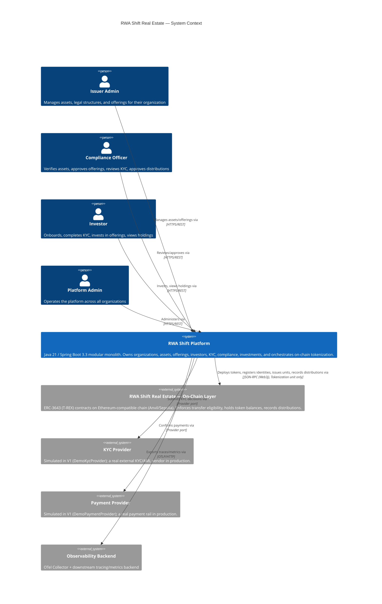

# C4 — Level 1: System Context

## Notes

- The platform is the only system investors, issuer staff, and compliance officers interact with
  directly. They never interact with the chain or with the KYC/payment providers directly.
- The on-chain layer ([`onchain/`](../../../onchain/README.md)) is modeled as an external system
  from the off-chain platform's point of view, even though both are developed in this same
  repository — the platform only ever reaches it through the `tokenization` unit's Web3j gateway,
  never by any other path (see [ADR-007](../adr/ADR-007-blockchain-source-of-truth-boundary.md)).
- KYC and payment providers are pluggable ports (`KycProvider`, `PaymentProvider`) with
  demo/simulated implementations in V1 (`DemoKycProvider`, `DemoPaymentProvider`) — swapping in a
  real vendor is an infrastructure-layer adapter change, not a domain change.
