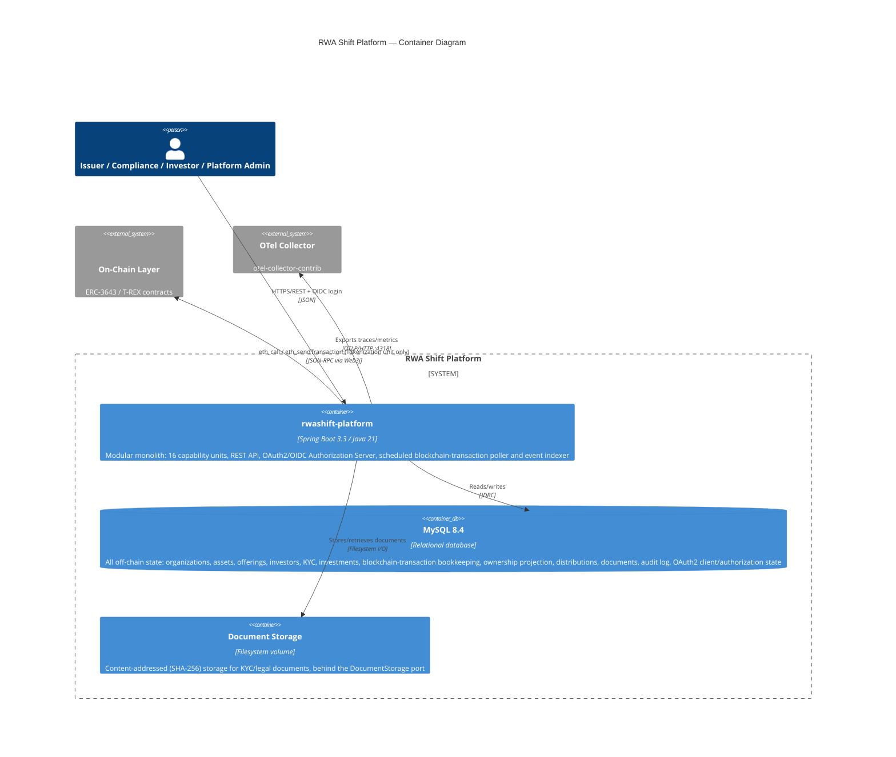

# C4 — Level 2: Container

## Notes

- **One deployable** (`rwashift-platform`), per [ADR-003](../adr/ADR-003-modular-monolith.md) —
  the "containers" here are the app, its database, its document store, and the two external
  systems it talks to, not a fleet of internally-decomposed services.
- `docker-compose.yml` additionally runs an `anvil` container for local development so the full
  stack (app + MySQL + a real chain + observability collector) is reproducible with one command
  — see the top-level [README](../../README.md#running-locally).
- Document Storage is a filesystem volume in V1 (`FilesystemDocumentStorage`); the `DocumentStorage`
  port is the seam for swapping in object storage (S3-compatible) later without touching the
  `document` unit's application logic.
