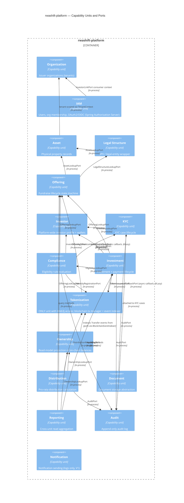

# C4 — Level 3: Component (inside `rwashift-platform`)

Shows the 16 capability units and the explicit `application/port` dependencies between them —
the only form of cross-unit coupling allowed (see
[ADR-002](../adr/ADR-002-composite-unit-structure.md)). Arrows point from consumer to the port's
owner.

## Notes

- Every `Rel` above corresponds to an actual constructor-injected `application/port` interface in
  the code — there is no hidden coupling beyond what's diagrammed (enforced by
  [ADR-002](../adr/ADR-002-composite-unit-structure.md)'s "no cross-unit entity/repository access"
  rule).
- `Tokenization ↔ Investment` and `Tokenization ↔ Offering` are bidirectional: the domain unit
  calls into Tokenization to *request* an on-chain effect; Tokenization calls back into the domain
  unit (via `@Lazy`-injected callback ports) once `BlockchainTransactionManager` observes
  confirmation. See [ADR-010](../adr/ADR-010-blockchain-transaction-lifecycle.md).
- `Ownership`'s relationship to `Tokenization` is not a port call but an async poll
  (`BlockchainEventIndexer.indexAllTokens()` reads `ContractDeploymentRepository` rows that
  `Tokenization` owns, then queries `Transfer` logs directly via `Web3jContractGateway`) — the one
  place Ownership indirectly touches chain data, still entirely inside the Tokenization unit's
  package for the actual RPC call.
- `Notification` has no inbound `Rel`s drawn because V1's `LoggingNotificationSender` is not yet
  wired as a call target from any unit — it exists as a ready port for when a unit needs to notify
  (e.g. KYC rejection, distribution completed).
